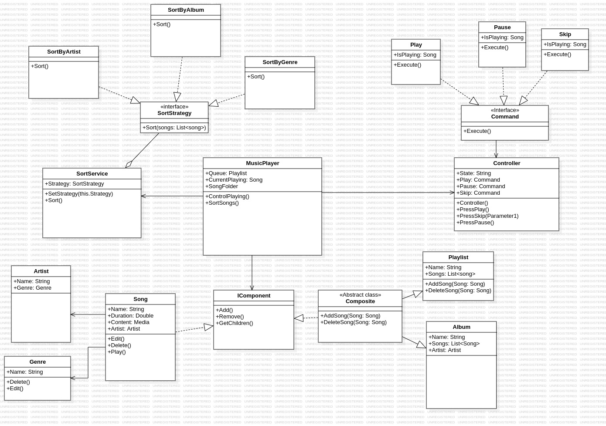

# Startdocument
The application is a music player. It can play mp3-files that are added to the application. 
With this music player the user should have the ability to view their music sorted in created playlists or sorted on album, artist and genre.
The user can add songs to a queue that will be played or play a song on it's own, the music can run in the background.
The player had controls such as play, pause and skip a song.


## functionaliteiten (MoSCoW)
The requirements of the application are analysed and sorted using the MoSCoW-method. This helps to identify the importance of each requirement.
**Must have's** need to be implemented into the application for it to work.
**Should have's** are supposed to be in the application but the application will work without it.
**Could have's** can be added to the application but not really important to the application.
**Won't have's** will not be implemented into the application.

| Must                             | Should                   | Could                              | Won't               |
| -------------------------------- | ------------------------ | ---------------------------------- | ------------------- |
| Controls: play, pause, skip      | Like song                | Search device for mp3-files        | Internet connection |
| Volume changing                  | Sort songs based on info | Change order of songs in playlists |                     |
| Make playlist                    | Edit mp3 file info       |                                    |                     |
| Make queue                       |                          |                                    |                     |
| List songs                       |                          |                                    |                     |
| Delete songs                     |                          |                                    |                     |
| Add songs                        |                          |                                    |                     |
| Read info from mp3 files         |                          |                                    |                     |
| Sort on album, artist and genre  |                          |                                    |                     |
| Music can play in the background |                          |                                    |                     |


## Design patterns
The following design patterns will be implemented into the application:

| Design pattern | Usage                                                      |
| -------------- | ---------------------------------------------------------- |
| Composite      | Managing mp3's and playlists.                              |
| Command        | Controlls like pause, play and skip.                       |
| Observer       | Updating UI based on changes that are made during runtime. |
| Strategy       | Sort on ablum, artist and genre.                           |


## Classdiagram



sortservice: Musicplayer has object sService or SService askes song list, sorts and gives back.
Extentie pijlen 


```c++
// Stragety Classes 
Interface SortStrategy {
    void sort(Arraylist<Songs>){}
}


public class SortByAlbum implements SortStrategy {
    @Override
    Public void sort(){
    }
}

public class SortByArtist implements SortStrategy {
    @Override
    Public void sort(){
    }
}

public class SortByGenre implements SortStrategy {
    @Override
    Public void sort(){
    }
}
```


## Tests
 - Tests 